# Docker Basic Configuration

## Pull Docker Image and Run Docker Container

- Pull Docker Image from [Docker Hub](https://hub/docker.com/r/dorowu/ubuntu-desktop-lxde-vnc/)  
```shell
$ docker pull dorowu/ubuntu-desktop-lxde-vnc:bionic-lxqt
```
- Run Docker Container
```shell
$ docker run -p 6080:80 -e USER=zgh -e PASSWORD=123456 -e RESOLUTION=1440x900 -v /dev/shm:/dev/shm dorowu/ubuntu-desktop-lxde-vnc:bionic-lxqt
```

## Basic Configuration

- Remove the Chromium Web Browser from **quicklaunch**:  
```note
Use the built-in Firefox Web Browser. Also, you can add it to *quicklaunch* to start it easily.
```
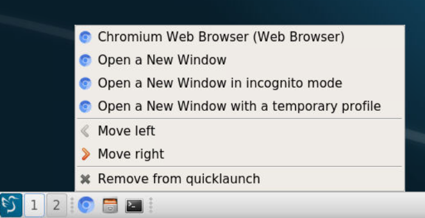

- [Optional]Change the apt sources:
```note
If your work host is in China, you need to modify the apt software sources. If not, then no modification is required.
```
```shell
# Step1: Backup
$ sudo cp /etc/apt/sources.list /etc/apt/sources.list.backup
# Step2: Modify /etc/apt/sources.list
$ sudo rm /etc/apt/sources.list
$ sudo vi /etc/apt/sources.list
# Step3: Copy the following Code to the file
deb https://mirrors.ustc.edu.cn/ubuntu/ bionic main restricted universe multiverse
deb-src https://mirrors.ustc.edu.cn/ubuntu/ bionic main restricted universe multiverse
deb https://mirrors.ustc.edu.cn/ubuntu/ bionic-updates main restricted universe multiverse
deb-src https://mirrors.ustc.edu.cn/ubuntu/ bionic-updates main restricted universe multiverse
deb https://mirrors.ustc.edu.cn/ubuntu/ bionic-backports main restricted universe multiverse
deb-src https://mirrors.ustc.edu.cn/ubuntu/ bionic-backports main restricted universe multiverse
deb https://mirrors.ustc.edu.cn/ubuntu/ bionic-security main restricted universe multiverse
deb-src https://mirrors.ustc.edu.cn/ubuntu/ bionic-security main restricted universe multiverse
deb https://mirrors.ustc.edu.cn/ubuntu/ bionic-proposed main restricted universe multiverse
deb-src https://mirrors.ustc.edu.cn/ubuntu/ bionic-proposed main restricted universe multiverse
# Step4: Save and Exit
[ESC]:wq
# Step5: Update software sources and Upgrade software
$ sudo apt-get update
$ sudo apt-get upgrade
```

- [Optional]Install the **Baidunetdisk**
```note
If your work host is in China, you need to install the **Baidunetdisk** to improve download speed. If not, no download is required.
```
- [Download from here](https://pan.baidu.com/download)
```shell
$ sudo dpkg -i baidunetdisk_3.5.0_amd64.deb
```
```tip
1. You are most likely to encounter an installation error, as shown below:
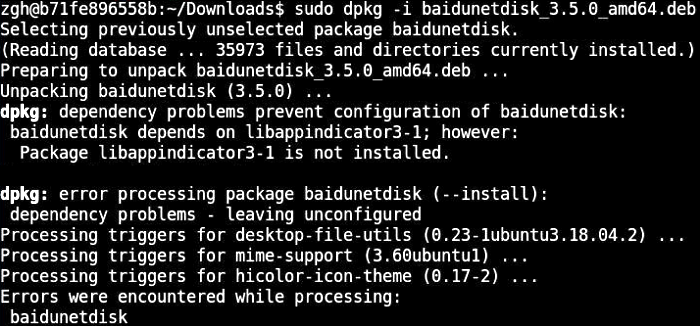
2. Fix the error: run `sudo apt-get install -f` to fix dependencies:
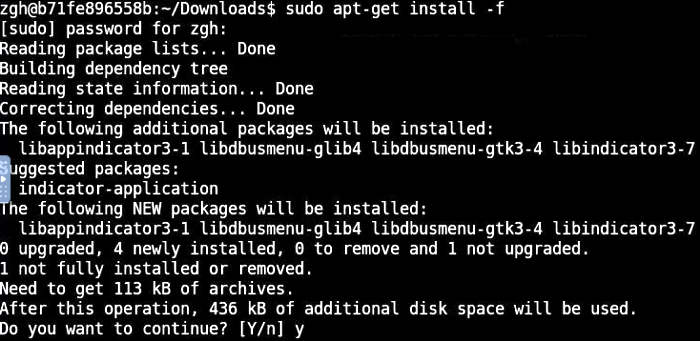
3. Then you can successfully install **Baidunetdisk**:
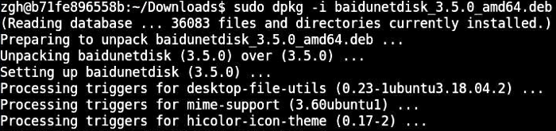
4. Verify installation to run `sudo dpkg -l | grep baidu`:
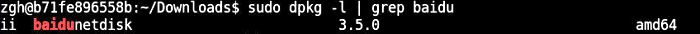
```
Now you can open **Baidunetdisk** and log in.  
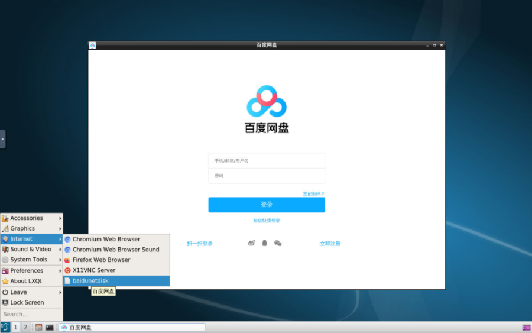

- Install Visual Studio Code
```note
If your work host is in China, you need to install **VSCode** from Baidunetdisk Share Link to improve install speed. If not, download it from the [official website](https://code.visualstudio.com).
```
Now you have downloaded the `.deb` installation package of VSCode.
```shell
$ sudo dpkg -i code_1.53.0-1612368357_amd64.deb
```
```tip
1. You are most likely to encounter an installation error, as shown below:
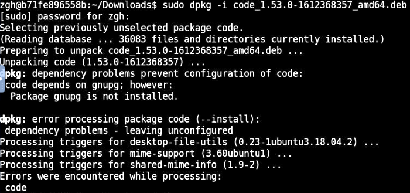
2. Fix the error: run `sudo apt-get install -f` to fix dependencies:
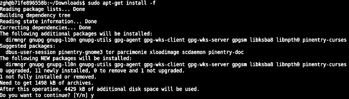
3. Then you can successfully install **VSCode**:
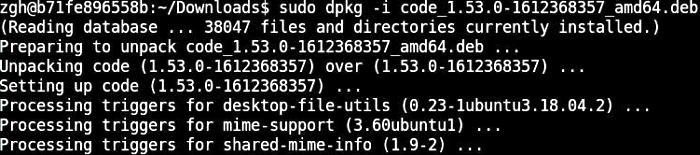
4. Verify installation to run `sudo dpkg -l | grep code`:
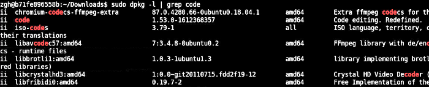
```
Now you can open **Visual Studio Code**.  
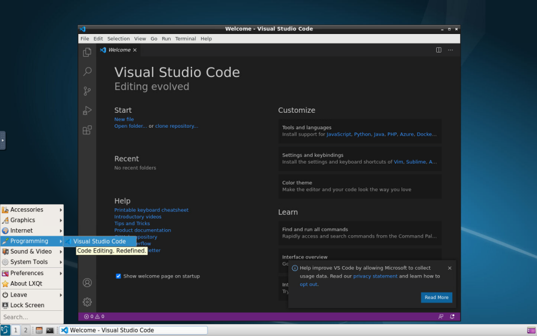

- [Optional]Install vim
```note
The `vi` editor that comes with the docker images is not easy to use, so download the `vim` editor. If you are used to using `vi` editor, you can skip the download.
```
```shell
$ sudo apt-get install vim
```
```tip
The following warning will appear when vim is installed in the docker image, I personally think it can be ignored, because it does not affect the use. As shown below:
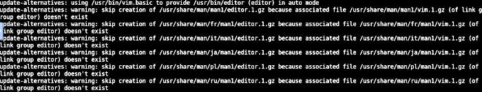
```

https://geographiclib.sourceforge.io/html/

wget neet to install before
perl: warning: Setting locale failed.
perl: warning: Please check that your locale settings: 
sudo apt-get install language-pack-en-base